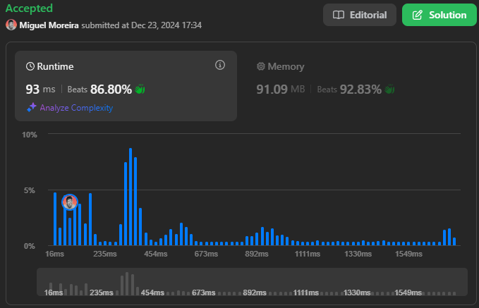
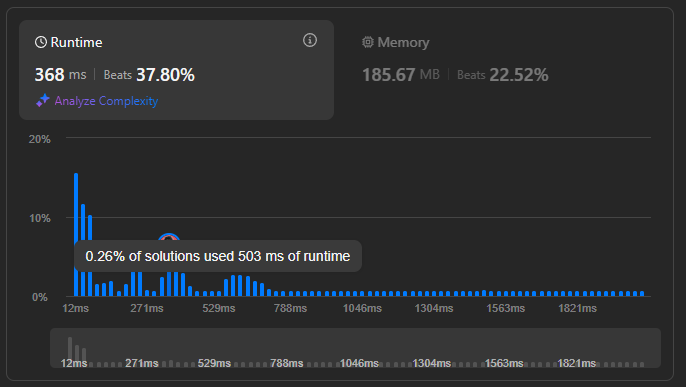
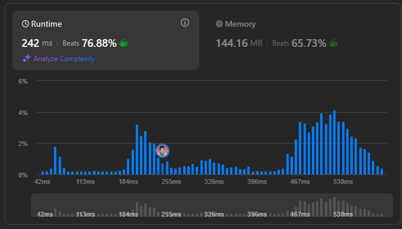

# Desafios LeetCode: Dividir e Conquistar

**Número da Lista**: 46 
**Conteúdo da Disciplina**: Dividir e Conquistar  

## 👥 Alunos
| Matrícula   | Aluno           |
|-------------|------------------|
| 18/0098080  | Arthur Trindade  |
| 20/2023968  | Miguel Moreira   |

## 📝 Sobre
Este repositório contém a solução de quatro desafios de Dividir e Conquistar do juiz online LeetCode. Foram resolvidas as questões difíceis de números **xxx** e **xxx**, e as questões de dificuldade média de número **xxx** e **xxx**.

**Tecnologias Utilizadas**: C

### Desafios Solucionados
| Código | Desafio                                                                                                      | Dificuldade |
|--------|--------------------------------------------------------------------------------------------------------------|-------------|
| 315    | [Count of Smaller Numbers After Self](https://leetcode.com/problems/count-of-smaller-numbers-after-self/description/) | Difícil|
| 912    | [Sort an Array](https://leetcode.com/problems/sort-an-array/description/) | Média |
| 493     | [Reverse Pairs](https://leetcode.com/problems/reverse-pairs/description/) | Difícil |

## 📸 Screenshots

  

  Resultado da submissão da solução para o desafio 315.

  

  Resultado da submissão da solução para o desafio 912.

  

  Resultado da submissão da solução para o desafio 493.

## 🚀 Uso
Para testar cada desafio:
1. Clique no link do desafio na tabela de questões da seção **Sobre**.
2. Cole o código referente ao desafio no campo de texto disponível na página do LeetCode.
3. Clique em **Run** para rodar a solução.

## 📚 Outros
Este projeto visa exercitar conceitos de Dividir e Conquistar, abordando diferentes níveis de dificuldade em problemas propostos no LeetCode, focando em construção de Dividir e Conquistar, manipulação de arestas e algoritmos de otimização.

